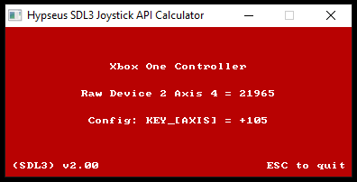

# Hypseus Joystick Configuration Helper

This utility will perform the SDL joystick *axis/button* conversion to use in the `hypinput.ini` file.

It will provide configuration details when multiple joysticks are detected.

This tool is now _SDL3_ based.

#### Important Note

This utility will only help calculate **Joystick API** configurations in _Hypseus_.  
It will **not** help if you are using a _GamePad_ and the **Game Controller** API via `-gamepad`

--- 
This utility will provide adjusted config values automatically.  

--- 

Connect your *joystick(s)*, run the utility, see configuration examples based on joystick actions.

Windows binaries are provided in `Releases`.

Create alternate configurations for use with the `-keymapfile` [argument](https://github.com/DirtBagXon/hypseus-singe/blob/master/doc/CmdLine.md).

Compile from source using `make`, this will produce:

    hypjsch
    hypjsch_cli

#### GUI:

#### CLI:

On remote sessions (*via ssh*), use the *cli* version `hypjsch_cli`:

    2 joystick(s) found

    Xbox One Controller:         Button: 101     - KEY_[ACT] = 101
    Xbox One Controller:         Axis: 104       - KEY_[AXIS] +104
    Xbox One Controller:         Axis: 102       - KEY_[AXIS] +102
    Xbox One Controller:         HAT - Set KEY_UP Button to: 100

    This program is free software: you can redistribute it and/or modify
    it under the terms of the [GNU General Public License] as published by
    the Free Software Foundation, either version 3 of the License, or
    (at your option) any later version.

    This program is distributed in the hope that it will be useful,
    but WITHOUT ANY WARRANTY; without even the implied warranty of
    MERCHANTABILITY or FITNESS FOR A PARTICULAR PURPOSE.  See the
    [GNU General Public License] for more details.

