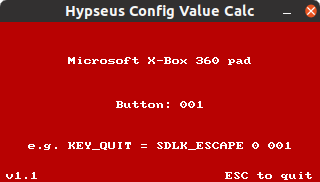

# Hypseus Joystick Configuration Helper

This utility will perform the SDL joystick *axis/button* conversion to use in the `hypinput.ini` file of [Hypseus Singe](https://github.com/DirtBagXon/hypseus-singe).

It will provide configuration details when multiple joysticks are detected.

--- 
This utility will provide adjusted config values automatically.  
You do **not** need to perform the `+1` addition to *button/axis* values, as described in the example config.

--- 

Connect your *joystick(s)*, run the utility, see configuration examples based on joystick actions.

Windows binaries are provided in `Releases`.

Create alternate configurations for use with the `-keymapfile` [argument](https://github.com/DirtBagXon/hypseus-singe#extended-arguments-and-keys).

Compile from source using `make`, this will produce:

    hypjsch
    hypjsch_cli

#### GUI:

#### CLI:

On remote sessions (*via ssh*), use the *cli* version `hypjsch_cli`:

    2 joystick(s) found
    Microsoft X-Box 360 pad:        Button: 001     - KEY_QUIT = SDLK_ESCAPE 0 001
    Microsoft X-Box 360 pad:        Axis: 001       - KEY_DOWN = SDLK_DOWN 0 0 -001
    Microsoft X-Box 360 pad:        Axis: 002       - KEY_DOWN = SDLK_DOWN 0 0 +002
    DragonRise Inc. Generic:        Button: 106     - KEY_QUIT = SDLK_ESCAPE 0 106
    DragonRise Inc. Generic:        Axis: 103       - KEY_DOWN = SDLK_DOWN 0 0 +103
    DragonRise Inc. Generic:        Axis: 104       - KEY_DOWN = SDLK_DOWN 0 0 -104

    This program is free software: you can redistribute it and/or modify
    it under the terms of the [GNU General Public License] as published by
    the Free Software Foundation, either version 3 of the License, or
    (at your option) any later version.

    This program is distributed in the hope that it will be useful,
    but WITHOUT ANY WARRANTY; without even the implied warranty of
    MERCHANTABILITY or FITNESS FOR A PARTICULAR PURPOSE.  See the
    [GNU General Public License] for more details.

